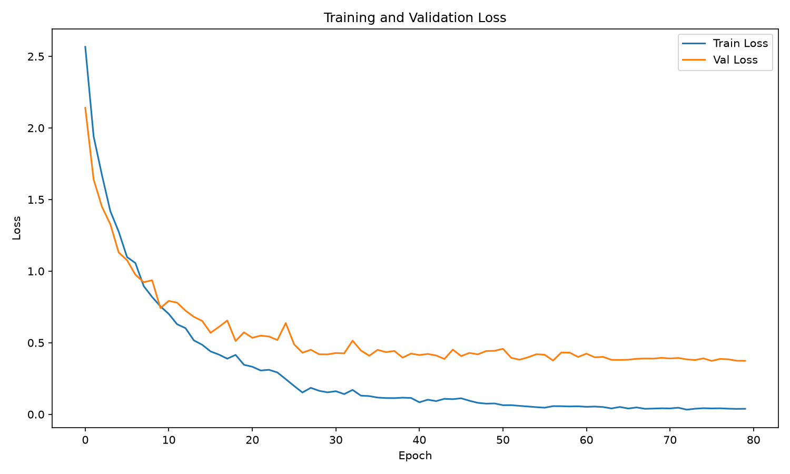
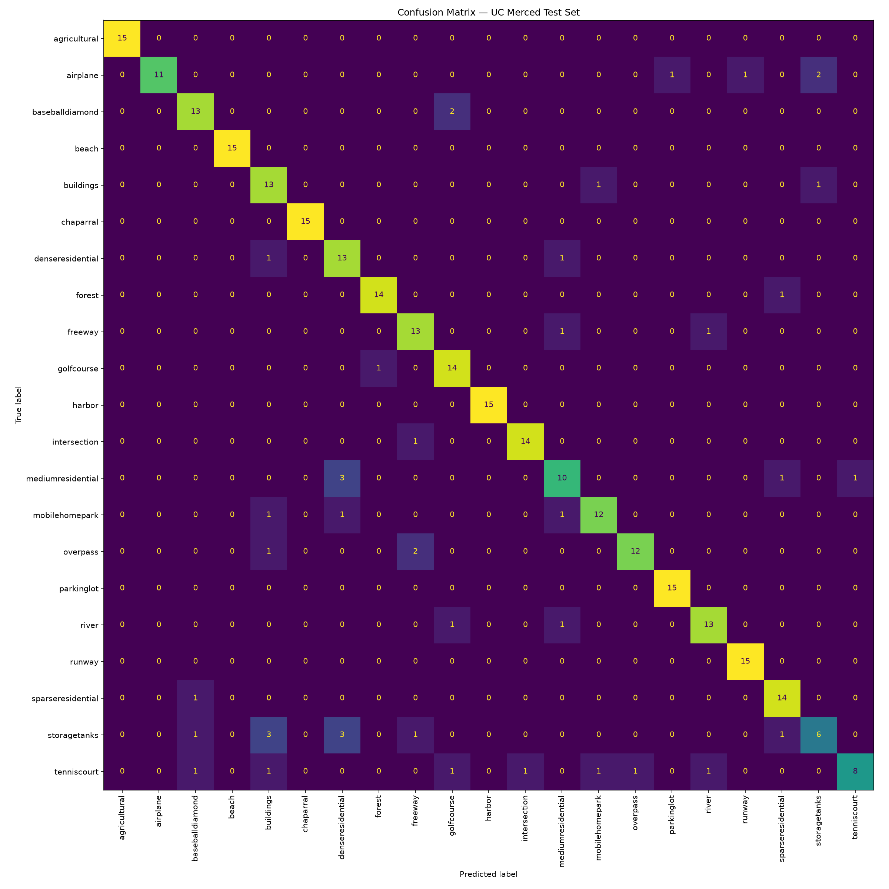
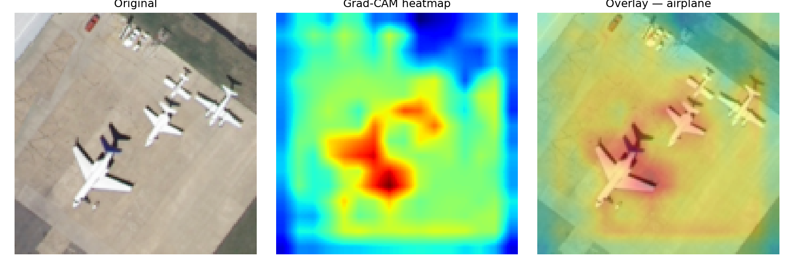
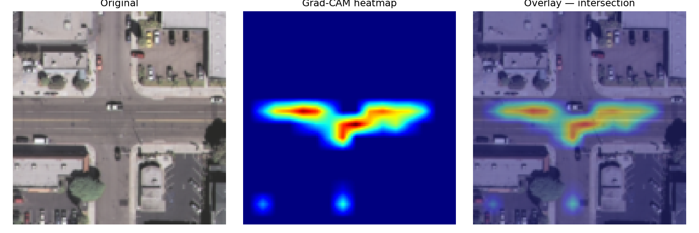
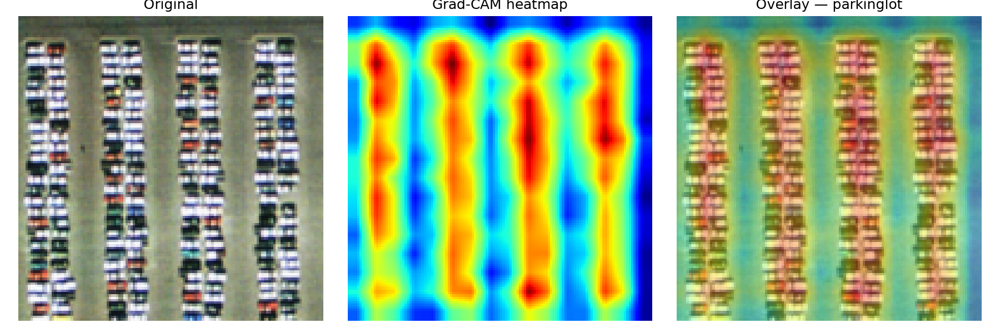
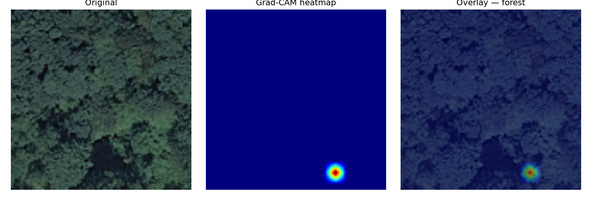

# Satellite Land Use Classifier

A convolutional neural network built **from scratch in PyTorch** that classifies
21 types of land use from satellite imagery. No pretrained weights — every
Conv2d layer written by hand. Trained on the
[UC Merced Land Use Dataset](http://weegee.vision.ucmerced.edu/datasets/landuse.html).

---

## Results

| Metric | Value |
|---|---|
| Test Accuracy | 85.71% |
| Val Accuracy (best) | 87.94% |
| Classes | 21 |
| Training images | 1,470 |
| No pretrained weights | ✓ |

---

## Architecture

Built with 4 convolutional blocks followed by a classifier head.
Every layer written manually — no ResNet, no transfer learning.


---

## Dataset

**UC Merced Land Use Dataset** — 2,100 aerial images across 21 land use
categories, 100 images per class, 256×256 pixels each.

| Split | Images |
|---|---|
| Train | 1,470 (70%) |
| Val | 315 (15%) |
| Test | 315 (15%) |

Splits are stratified — every class has equal representation in each split.

**Classes:** agricultural, airplane, baseballdiamond, beach, buildings,
chaparral, denseresidential, forest, freeway, golfcourse, harbor,
intersection, mediumresidential, mobilehomepark, overpass, parkinglot,
river, runway, sparseresidential, storagetanks, tenniscourt

---

## Training Setup

| Setting | Value |
|---|---|
| Optimizer | Adam (lr=1e-4) |
| Scheduler | ReduceLROnPlateau (patience=5, factor=0.5) |
| Loss | CrossEntropyLoss |
| Epochs | 80 |
| Batch size | 32 |
| Image size | 128×128 |
| Weight decay | 1e-4 |

**Train augmentation:** RandomHorizontalFlip, RandomVerticalFlip,
RandomRotation(45), Normalize(0.5, 0.5)

**Val/Test:** Resize + Normalize only (no augmentation)

---

## Loss Curves



Both curves drop sharply in the first 10 epochs. From epoch 25 onwards,
train loss continues falling toward zero while val loss plateaus around 0.38.
This gap is expected — the dataset has only 100 images per class, which limits
generalisation. The model is memorising training examples in later epochs
rather than learning new patterns.

---

## Confusion Matrix



**Test accuracy: 85.71%** across 21 classes.

Most confused class pairs:

| True | Predicted | Reason |
|---|---|---|
| storagetanks | baseballdiamond | Both are circular structures from above |
| mediumresidential | denseresidential | Nearly identical layout at satellite resolution |
| tenniscourt | parkinglot | Similar rectangular geometry and colour |

These are intelligent failures — the model confuses classes that are
genuinely visually similar from a satellite viewpoint, not random errors.

---

## Grad-CAM Visualisations

Grad-CAM shows which spatial regions of the input drove each prediction.
Implemented from scratch using PyTorch forward and backward hooks.

**Airplane** — heatmap centres on aircraft bodies, not the runway or ground.
The model learned to detect the distinctive wing shape.



**Intersection** — activation fires precisely on the road crossing.
The model detects the cross pattern of perpendicular roads.



**Parkinglot** — activates on the vertical lanes between car rows.
The repeating stripe pattern is the discriminating feature.



**Forest** — heatmap is flat blue (uniform, no dominant region).
The model recognises forest from global texture across the whole image,
not from any specific location. This makes sense — forest looks the same
everywhere in the frame.



---

## Project Structure
├── dataset.py # UCMercedDataset class, stratified splits
├── model.py # CNN architecture (4 conv blocks)
├── train.py # Training loop, validation, checkpointing
├── evaluate.py # Test set evaluation, confusion matrix
├── gradcam.py # Grad-CAM with PyTorch hooks
├── utils.py # Loss saving and plotting
├── checkpoints/ # Saved model weights
├── outputs/
│ ├── loss_curve.png
│ ├── confusion_matrix.png
│ └── gradcam/ # 21 Grad-CAM images (one per class)
└── requirements.txt


---

## Quick Start

```bash
git clone https://github.com/yourusername/uc-merced-classifier
cd uc-merced-classifier
pip install -r requirements.txt

# Download UC Merced dataset and place at UCMerced_LandUse/Images/

python3 train.py       # train the model
python3 evaluate.py    # test accuracy + confusion matrix
python3 gradcam.py     # generate Grad-CAM visualisations
```

---

